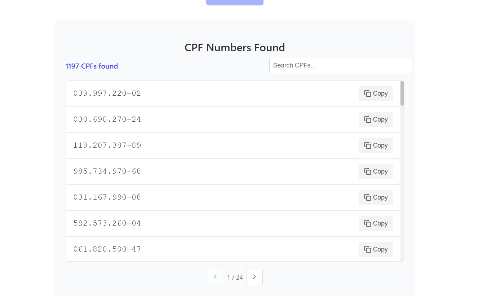

## Seções do projeto

- [Instalação e Execução](#🚀-instalação-e-execução)
- [Rotas](#-🔨-Rotas-da-API)
- [Telas](#-💻-Telas)

## 🔨 Instalação e Execução

É necessário ter instalado em sua máquina o `node.js`, para executar a aplicação localmente, siga estas etapas:

1. Clone o reposítorio e abra com alguma `IDE` de preferencia o `visual studio code`.

2. Para rodar o backend acesse a pasta backend no terminal com o comando:

   `cd backend`

3. Agora rode o comando:
   `npm install`

4. Configuração do arquivo .env

   4.2 Crie o arquivo .env e copiei as chaves que estão no arquivo .env.example

   4.2 Acesse o firebase crie um banco com o fire real time.

   4.3 A chave FIREBASE_PRIVATE_KEY_BASE64 está com encode do base64, com ela gerada no arquivo .json do firebase selecione os `\n` do arquivo e apague todos, quebre as linhas do mesmo, e apague os espaços em branco, você pode utilizar esse <a href="https://www.base64decode.org/">site</a> para fazer o encode da chave.

5. Rode o servidor com o comando:
   `npm run dev`

6. Para rodar o front-end acesse outro terminal e abra a pasta frontend com o comando:
   `cd frontend`

7. Rode o comando:
   `npm install`

8. Rode o servidor com o comando:
   `npm run serve`

## 🔨 Rotas da API

| Método | Endpoint | Responsabilidade                                                       | Autenticação                  |
| ------ | -------- | ---------------------------------------------------------------------- | ----------------------------- |
| POST   | /upload  | Faz o upload do arquivo .pdf e captura todos os cpfs dentro do arquivo | Não necessita de autenticação |
| GET    | /upload  | Retorna todos os cpfs capturados                                       |

### **POST - /upload**

Rota de upload do pdf e captura dos cpfs

**\*Url da requisição**: `http://localhost:3000/upload`

| Dados de Envio:           |
| ------------------------- |
| Body: multipart/form-data |

```form-data

  pdf	File	Arquivo PDF com os CPFs a serem extraídos

```

| Resposta do servidor:                               |
| --------------------------------------------------- |
| Body: Formato Json                                  |
| Status code: <b style="color:green">201 Created</b> |

```json
{
  "cpfs": ["123.456.789-00", "987.654.321-00"]
}
```

### **GET - /upload**

Rota de busca dos cpfs

**\*Url da requisição**: `http://localhost:3000/upload`

| Resposta do servidor:                          |
| ---------------------------------------------- |
| Body: Formato Json                             |
| Status code: <b style="color:green">200 OK</b> |

```json
{
  "cpfs": ["123.456.789-00", "987.654.321-00"]
}
```

## 💻 Telas


<br/>


